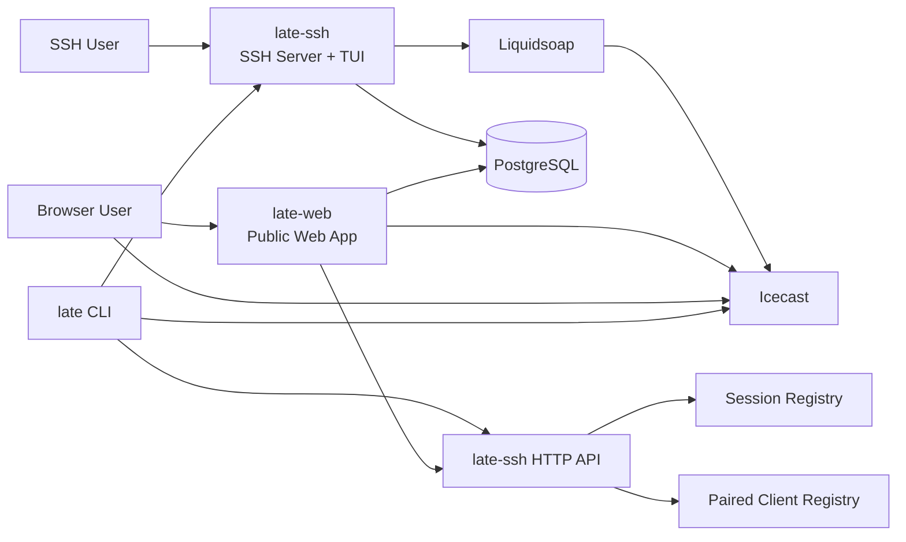
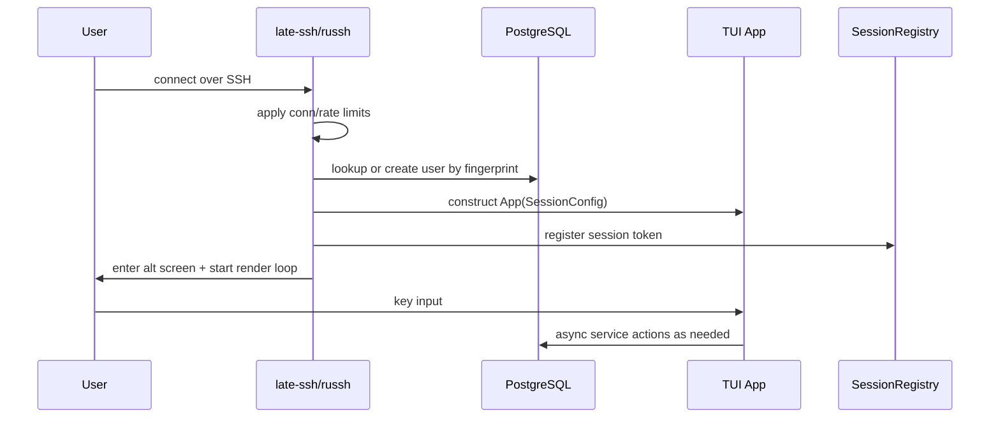
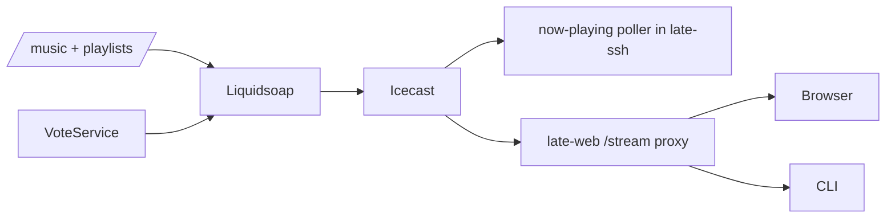

# late.sh Architecture Breakdown

_Last generated: 2026-05-04_

This document is a contributor-oriented architecture map of the `late.sh` repository. It is meant to answer: _what lives where, what talks to what, what state is durable vs in-memory, and where to start when contributing_.

---

## 1. Executive Summary

`late.sh` is a **terminal-first social application** delivered primarily over **SSH**.

At a high level, the project is made of four Rust crates:

- **`late-core`** — shared foundation: DB access, models, migrations, telemetry, utility code
- **`late-ssh`** — the main product runtime: SSH server, TUI app, HTTP API, pairing, multiplayer/session state
- **`late-web`** — public website, browser pairing UI, gallery, profiles, browser tunnel, audio stream proxy
- **`late-cli`** — companion local client for SSH launch + local audio playback + visualizer pairing

The platform is backed by:

- **PostgreSQL** for persistent application state
- **Icecast** for audio streaming
- **Liquidsoap** for playlist/radio orchestration
- **Axum** for HTTP services
- **russh** for SSH
- **ratatui** for the terminal UI
- **Tokio** for async runtime

The core product loop is:

1. User connects via `ssh late.sh`
2. `late-ssh` authenticates via SSH public key fingerprint
3. A per-session TUI app is created
4. The app subscribes to shared service snapshots/events
5. The user chats, plays games, votes on music, edits profile/artboard, or joins rooms
6. Optional browser/CLI pairing connects to the same session token for audio + visualizer + controls

---

## 2. Top-Level Architecture



### Responsibilities by runtime

- **`late-ssh`** is the real application brain.
  - Handles SSH sessions
  - Owns most domain services
  - Hosts the pairing API and web tunnel/chat WS endpoints
  - Maintains in-memory session registries and process-local multiplayer state
- **`late-web`** is mostly a presentation layer and proxy.
  - Renders marketing/public pages
  - Bridges browsers into pairing/chat/tunnel flows
  - Reads persisted artboard/profile data from DB
  - Proxies `/stream` to the audio source with silence fallback
- **`late-cli`** is a power-user client.
  - Starts SSH
  - Plays audio locally
  - Analyzes output audio for visualizer frames
  - Sends pairing state back to `late-ssh`
- **`late-core`** is the shared library underneath the others.

---

## 3. Repository Layout

```text
late-sh/
├── Cargo.toml              # workspace definition
├── README.md               # product-level intro
├── CONTEXT.md              # deep repo context and invariants
├── late-core/              # shared DB/models/telemetry/utilities
├── late-ssh/               # SSH server + TUI app + HTTP API
├── late-web/               # website + browser pairing + stream proxy
├── late-cli/               # companion CLI client
├── infra/                  # Terraform + service deployment config
├── monitoring/             # telemetry collector and Grafana provisioning
├── scripts/                # install/dev/music helper scripts
└── docker-compose.yml      # local development stack
```

---

## 4. Crate-by-Crate Breakdown

## 4.1 `late-core`

### Purpose
`late-core` is the shared foundation crate. It owns the parts that should not depend on any single frontend/runtime.

### Main responsibilities

- Database config and connection pooling
- Embedded migrations
- Shared data models and table contracts
- Shared API types
- Telemetry setup
- Rate limiting utility
- Shared nonogram schema/generation support
- Testcontainers-based DB test helpers

### Important files

- `late-core/src/lib.rs` — public module surface
- `late-core/src/db.rs` — DB pool creation, health, migrations
- `late-core/src/model.rs` — model macro infrastructure
- `late-core/src/models/` — DB-backed domain models
- `late-core/src/nonogram.rs` — shared nonogram pack contracts and daily selection
- `late-core/src/rate_limit.rs` — per-IP sliding-window limiter
- `late-core/src/telemetry.rs` — OpenTelemetry bootstrap
- `late-core/src/test_utils.rs` — integration test DB helpers
- `late-core/src/bin/gen_nonograms.rs` — offline nonogram pack generator

### Architectural role
Think of `late-core` as the **schema and infrastructure spine**. If a feature needs:

- a new table
- a persistent model
- a migration
- shared types between services

it usually starts here.

### Core model groups
The `models/` directory shows the actual domain map:

- **identity/profile**: `user`, `profile`, `work_profile`, `showcase`
- **chat/social**: `chat_room`, `chat_room_member`, `chat_message`, `notification`
- **music/voting**: `vote`
- **games**: `sudoku`, `nonogram`, `minesweeper`, `solitaire`, `tetris`, `twenty_forty_eight`, `blackjack`, `chips`, `leaderboard`, `game_room`
- **artboard/moderation**: `artboard`, `artboard_ban`, `room_ban`, `server_ban`, `moderation_audit_log`
- **feed state**: `article_feed_read`, `mention_feed_read`, `showcase_feed_read`, `work_feed_read`
- **bonsai**: `bonsai`

---

## 4.2 `late-ssh`

### Purpose
`late-ssh` is the main application runtime. It is both:

- an **SSH server** serving the TUI experience
- an **HTTP/WebSocket API server** for pairing, browser chat, and browser tunnel features

This crate contains most of the product logic.

### High-level subareas

- **Server boot and orchestration**
- **Per-session TUI app state/render/input**
- **Domain services** for chat, profile, voting, games, rooms, artboard, bonsai
- **Session registries** for browser/CLI pairing
- **Moderation/authz**
- **WebSocket adapters**

### Important entrypoints

- `late-ssh/src/main.rs` — process bootstrap
- `late-ssh/src/ssh.rs` — SSH server + render loop
- `late-ssh/src/api.rs` — HTTP API and pairing endpoints
- `late-ssh/src/state.rs` — global process state container
- `late-ssh/src/session.rs` — session registry + paired client registry
- `late-ssh/src/dartboard.rs` — artboard server persistence wrapper
- `late-ssh/src/web.rs` — browser chat registry support
- `late-ssh/src/web_tunnel.rs` — browser TUI tunnel plumbing

### Boot sequence
At startup, `late-ssh/src/main.rs` does roughly this:

1. Initialize telemetry
2. Load config
3. Create DB pool and run migrations
4. Ensure the general chat room exists
5. Construct shared services:
   - `VoteService`
   - `NotificationService`
   - `ChatService`
   - `AiService`
   - `ProfileService`
   - article/showcase/work services
   - game services
   - `RoomsService`
   - room game managers
   - `BonsaiService`
   - `LeaderboardService`
6. Restore/load process-level artboard state
7. Create global registries and rate limiters
8. Build a global `State`
9. Spawn:
   - API server
   - SSH server
   - leaderboard refresh loop
   - vote background loop
   - ghost/AI background loop
   - limiter cleanup task
   - artboard snapshot rollover task
   - now-playing poller
10. Coordinate graceful shutdown and session drain

### Global process state
`late-ssh/src/state.rs` contains the cross-session `State` shared by the runtime.

It includes:

- config
- DB handle
- all major services
- nonogram library
- room game managers/registry
- shared artboard server + provenance
- leaderboard service
- connection semaphore + per-IP counters
- active user map
- activity feed broadcaster
- now-playing watch channel
- session and paired client registries
- web chat registry
- SSH/WS rate limiters
- drain flag

This is effectively the **composition root** of the live backend.

---

## 4.3 `late-web`

### Purpose
`late-web` is the browser-facing frontend.

It is intentionally thinner than `late-ssh`: it mostly renders pages, proxies some data, and connects browsers back to `late-ssh` for real-time functionality.

### Main responsibilities

- landing page and pairing page
- browser chat page
- browser TUI demo page (`/play`)
- public profiles pages
- artboard gallery
- now-playing/status fragments
- stable `/stream` proxy to audio backend with silence fallback

### Important files

- `late-web/src/main.rs` — bootstraps the Axum server
- `late-web/src/lib.rs` — router composition and app state
- `late-web/src/config.rs` — env-driven config
- `late-web/src/pages/mod.rs` — route composition root
- `late-web/src/pages/connect/` — landing + pairing page
- `late-web/src/pages/chat/` — browser chat page
- `late-web/src/pages/play/` — browser TUI tunnel page
- `late-web/src/pages/gallery/` — read-only artboard gallery
- `late-web/src/pages/profiles/` — work profile pages
- `late-web/src/pages/stream.rs` — Icecast stream proxy with fallback silence
- `late-web/src/error.rs` — error responses/templates

### Architectural role
`late-web` is best understood as a **public shell** around the SSH app:

- The browser **does not replace** the SSH app.
- It augments it with pairing, public discovery, and web-native views.
- Real-time browser experiences still depend heavily on `late-ssh` endpoints.

---

## 4.4 `late-cli`

### Purpose
`late-cli` is a local companion app for users who want the TUI in the terminal but audio from local speakers.

### Main responsibilities

- launch/authenticate SSH session
- obtain session token
- play MP3 stream locally
- analyze played audio for visualizer data
- connect to `/api/ws/pair`
- receive mute/volume controls from the TUI

### Important files

- `late-cli/src/main.rs` — top-level orchestration
- `late-cli/src/config.rs` — args/env/defaults
- `late-cli/src/identity.rs` — SSH key generation/discovery
- `late-cli/src/ssh.rs` — native/OpenSSH/legacy SSH modes
- `late-cli/src/ws.rs` — pairing WebSocket protocol
- `late-cli/src/audio/` — decode, output, analyzer, resampler

### Architectural role
The CLI is a **paired satellite client**. It is not an alternative backend; it is a specialized frontend for:

- reliable local audio
- live visualizer sync
- hardware/OpenSSH-friendly session launch

---

## 5. Request and Session Flows

## 5.1 SSH session lifecycle



### Authentication model
- Identity is derived from **SSH public key fingerprint**
- User records are created/found in the DB
- Password and keyboard-interactive auth are rejected
- `LATE_SSH_OPEN=true` still means public-key auth only

### Session token role
Every SSH session gets a compact token. That token is used by:

- browser pairing
- CLI pairing
- browser chat
- browser tunnel flows

It is the bridge between a terminal session and secondary clients.

---

## 5.2 Pairing flow

```mermaid
flowchart LR
    TUI[TUI Session] <-- mpsc --> SR[SessionRegistry]
    BrowserOrCLI[Browser or late CLI] --> WS[/api/ws/pair]
    WS --> SR
    WS --> PCR[PairedClientRegistry]
    TUI --> PCR
```

### Two registries matter here

#### `SessionRegistry`
Maps:
- `session_token -> mpsc sender`

Used for inbound messages headed **to the SSH app**, such as:
- heartbeat
- visualizer frames
- moderation/permission/session messages

#### `PairedClientRegistry`
Maps:
- `session_token -> control sender + latest client audio state`

Used for outbound control headed **to the paired browser/CLI**, such as:
- toggle mute
- volume up
- volume down

### Net effect
The SSH app can:
- show whether a browser or CLI is paired
- display paired client state
- render visualizer bars from paired audio data
- control remote/local playback without playing audio itself

---

## 5.3 Web flow

Browser routes mostly fan back into `late-ssh`:

- `/` — public landing page
- `/{token}` — pairing page using `/api/ws/pair`
- `/chat/{token}` — browser chat using `late-ssh` WS chat endpoint
- `/play` — browser tunnel into a terminal session via `late-ssh` WS tunnel endpoint
- `/gallery` — reads persisted artboard snapshots directly from DB
- `/profiles` — reads persisted work/profile/showcase data from DB
- `/stream` — proxies upstream audio stream

This means `late-web` is split between:

- **DB-backed public pages**
- **`late-ssh`-backed real-time pages**

---

## 6. TUI Architecture Inside `late-ssh`

The TUI is built around a deliberate sync/async split.

## 6.1 Core idea

- **Async services** fetch/store/update data
- **UI state objects** subscribe to snapshots/events
- **`App::tick()`** drains updates into local state
- **`App::render()`** is synchronous and only paints in-memory state
- **Input handlers** trigger service work fire-and-forget

This avoids blocking the SSH render loop on DB/network work.

## 6.2 Main app structure

Key files:

- `late-ssh/src/app/state.rs` — giant `App` state object and `SessionConfig`
- `late-ssh/src/app/input.rs` — input parsing and dispatch
- `late-ssh/src/app/tick.rs` — world updates/channel draining
- `late-ssh/src/app/render.rs` — frame rendering
- `late-ssh/src/app/mod.rs` — app module root

### Main UI areas
The major top-level screens are:

- `Dashboard`
- `Chat`
- `Games`
- `Rooms`
- `Artboard`

Each screen has its own state/input/UI modules or subtrees.

## 6.3 Shared domain module pattern
Many app subdomains follow the same shape:

- `mod.rs` — module declarations
- `state.rs` — UI state and transitions
- `input.rs` — key handling
- `ui.rs` — rendering
- `svc.rs` — async service layer

That pattern is especially visible in:

- `chat/`
- `vote/`
- `profile/`
- most games
- `rooms/blackjack`
- `artboard/`

This is a useful contribution convention: feature logic is often intentionally split into **state vs input vs UI vs service**.

---

## 7. Feature Domains in `late-ssh`

## 7.1 Chat domain

### Location
- `late-ssh/src/app/chat/`
- extra details in `late-ssh/src/app/chat/CONTEXT.md`

### Responsibilities
- room list and room selection
- message send/read state
- mentions/notifications
- news feed
- showcase feed
- work feed
- browser chat synchronization
- AI summaries / related enrichments

### Subdomains
- `news/`
- `notifications/`
- `showcase/`
- `work/`
- `discover/`

### Supporting services
- `ChatService`
- `NotificationService`
- `ArticleService`
- `ShowcaseService`
- `WorkService`

### Storage model
Persistent data lives in:
- `chat_rooms`
- `chat_room_members`
- `chat_messages`
- `notifications`
- related feed checkpoint tables

### Architectural note
Chat is both:
- a classic persisted messaging feature
- the backbone for several pseudo-feeds surfaced inside the same screen

---

## 7.2 Vote/music domain

### Location
- `late-ssh/src/app/vote/`

### Responsibilities
- collect user genre votes
- maintain current vote state/snapshot
- switch active genre on interval
- send commands to Liquidsoap
- publish activity updates

### Integration
The vote system is coupled to the audio pipeline:

- user votes persist to DB
- `VoteService` computes/refreshes the active snapshot
- background task periodically switches genre
- Liquidsoap is updated to change the effective playlist source

---

## 7.3 Games domain

### Location
- `late-ssh/src/app/games/`

### Shipped/present games
- 2048
- Tetris
- Sudoku
- Nonograms
- Minesweeper
- Solitaire

### Shared supporting pieces
- `games/leaderboard/` — leaderboard snapshot service
- `games/chips/` — Late Chips economy
- `games/ui.rs` — hub rendering
- `games/input.rs` — high-level routing

### Architectural split
Games fall into two broad categories:

#### Single-player persisted games
These store user progress in DB and restore it per session.
Examples:
- 2048
- Tetris
- Sudoku
- Nonograms
- Minesweeper
- Solitaire

#### Room-based multiplayer/table games
These run under `rooms/` and are backed by a mix of DB + process-local runtime state.
Examples:
- Blackjack
- TicTacToe scaffolding/runtime

### Chips economy
`ChipService` supports a cross-game economy:
- daily stipend
- reward payouts for daily wins
- leaderboard usage
- balance integration with room games like Blackjack

---

## 7.4 Rooms domain

### Location
- `late-ssh/src/app/rooms/`
- deep details in `late-ssh/src/app/rooms/CONTEXT.md`

### Responsibilities
- persistent room directory and metadata
- game-room creation/listing/deletion
- room filters/search
- embedding room-specific games
- room-backed chat integration

### Key pieces
- `svc.rs` — persistent room service
- `registry.rs` — room game registry
- `backend.rs` — active room backend abstraction
- `blackjack/` — multiplayer Blackjack runtime
- `tictactoe/` — another room game implementation track

### Persistence boundary
- **Room metadata** is persisted in Postgres (`game_rooms`, linked `chat_rooms`)
- **Live table runtime state** is process-local and managed in memory by table managers

This is one of the most important architectural boundaries in the repo.

---

## 7.5 Artboard domain

### Location
- `late-ssh/src/app/artboard/`
- `late-ssh/src/dartboard.rs`
- deep details in `late-ssh/src/app/artboard/CONTEXT.md`

### Purpose
A shared multi-user ASCII canvas.

### Runtime model
- one in-process shared `dartboard_local::ServerHandle` for the whole server process
- users connect when they enter the Artboard screen
- leaving disconnects their local client and frees the slot
- persisted snapshots are saved to Postgres

### Persistence model
The gallery reads **saved snapshots**, not live in-memory canvas state.
So:
- live board state exists in-process
- durable board history exists in DB
- web gallery can lag the live board slightly

### Important implication
This subsystem is not purely stateless or purely DB-driven; it is a **hybrid live-state + snapshot-persistence** feature.

---

## 7.6 Profile/showcase/work domain

### Locations
- `late-ssh/src/app/profile/`
- `late-ssh/src/app/profile_modal/`
- `late-ssh/src/app/settings_modal/`
- `late-ssh/src/app/chat/showcase/`
- `late-ssh/src/app/chat/work/`
- `late-web/src/pages/profiles/`

### Responsibilities
- profile editing in SSH
- user settings and themes
- showcase links/projects
- public work profiles and public web listing

### Architectural note
This feature spans both frontends:
- editing/management is primarily in SSH
- public viewing is primarily in web

---

## 7.7 Bonsai domain

### Location
- `late-ssh/src/app/bonsai/`

### Purpose
A persistent personal bonsai mechanic with daily care/growth/death state.

### Characteristics
- per-user persistent feature
- tightly integrated into TUI state
- has both service and modal/UI subcomponents

This is an example of a highly self-contained feature with its own state machine and DB persistence.

---

## 7.8 AI domain

### Location
- `late-ssh/src/app/ai/`

### Responsibilities
- AI integrations/services
- ghost/bot behaviors
- content summarization or assistant-like enrichment

### Architectural note
AI is integrated as a supporting subsystem rather than a top-level product surface. It plugs into chat/news/automation rather than owning the main experience.

---

## 8. State Model: What Is Persistent vs In-Memory

This project has a very important split between **durable state** and **live process state**.

## 8.1 Persistent state in PostgreSQL

Examples:

- users and profile settings
- votes
- chat rooms/messages/memberships
- notifications
- article/showcase/work feed state
- game save data and daily completion data
- chips balances
- bonsai trees/care logs
- room metadata
- artboard snapshots and provenance archives
- moderation and bans

## 8.2 In-memory process-local state

Examples:

- active SSH sessions
- token -> session routing
- token -> paired client routing
- active user presence map
- activity feed broadcast channel
- watch/broadcast snapshots inside services
- currently paired client state
- live Blackjack tables
- live TicTacToe tables
- live artboard server state
- current per-session TUI app state

## 8.3 Why this matters
Contributors need to know which changes are:

- **safe in single-process assumptions**
- **shared across restarts**
- **multi-replica unsafe**

Anything using:
- registries
- broadcast/watch channels
- in-proc managers
- active session maps

is likely **not horizontally shared** across multiple replicas.

---

## 9. Communication Patterns

## 9.1 DB-backed request/response
Standard async service methods read/write Postgres.

Used for:
- user/profile data
- chat history
- game persistence
- public pages

## 9.2 Watch channels for latest snapshot state
Used where consumers need the latest state immediately.

Examples:
- votes
- leaderboard
- per-user profile snapshots
- rooms snapshot

## 9.3 Broadcast channels for transient events
Used where ephemeral notifications are OK.

Examples:
- activity feed
- event banners
- transient service events

## 9.4 MPSC channels for targeted session delivery
Used for session-token routing.

Examples:
- pair visualizer frames into a specific SSH session
- control messages toward a specific live session path

---

## 10. Audio Architecture



### Components
- **Liquidsoap** manages source playlists and switching
- **Icecast** serves the actual stream
- **`late-ssh`** polls now-playing metadata
- **`late-web`** exposes a stable browser-consumable `/stream`
- **`late-cli`** consumes the stream locally

### Control path
Genre changes originate from the app vote system and flow into Liquidsoap.

### Playback path
Actual audio playback happens in:
- browser pairing page, or
- local CLI audio runtime

The SSH TUI itself does not play audio; it controls/visualizes paired clients.

---

## 11. WebSocket and API Surface

## 11.1 `late-ssh` API surface
Main routes called out in repo context:

- `GET /api/health`
- `GET /api/now-playing`
- `GET /api/status`
- `GET /api/ws/pair?token=...`

Additional real-time browser features are also routed through `late-ssh`, including chat and tunnel endpoints consumed by `late-web`.

## 11.2 Pairing protocol
Client -> server messages include:
- `heartbeat`
- `viz`
- `client_state`

Server -> client messages include:
- `toggle_mute`
- `volume_up`
- `volume_down`

### Design consequence
The protocol is intentionally small. `late-ssh` stays authoritative for session routing, while browser/CLI stay authoritative for local playback state.

---

## 12. Infrastructure Architecture

### Local development stack
From `docker-compose.yml` / README:

- Postgres
- Icecast
- Liquidsoap
- app services built/run locally or in Docker

### Infra code
`infra/` contains Terraform for deployed infrastructure, including:

- backend/provider config
- service definitions for web/ssh
- ingress and TCP forwarding
- monitoring
- cert-manager
- storage and support services

### Monitoring
`monitoring/` contains provisioning for:

- Grafana
- OTEL collector
- VictoriaMetrics/VictoriaLogs/VictoriaTraces style pipeline

### Operational nuance
A number of runtime features rely on **long-lived connections** and **single-process memory state**, especially SSH and WS session routing. That makes graceful drain behavior and connection handling a major part of the architecture, not an implementation detail.

---

## 13. Contribution Hotspots

If you want to contribute, these are good mental entry points.

## 13.1 New persisted feature
Touch:
- `late-core/src/models/...`
- migrations via `late-core`
- possibly a new `svc.rs` in `late-ssh`
- TUI state/input/UI modules
- maybe `late-web` public pages

## 13.2 New TUI feature
Follow existing module layout in `late-ssh/src/app/...`:
- `state.rs`
- `input.rs`
- `ui.rs`
- `svc.rs` if async work exists

## 13.3 New public web page
Touch:
- `late-web/src/pages/...`
- `late-web/src/pages/mod.rs`
- Askama templates
- maybe `late-core` models if DB-backed

## 13.4 New game
Likely touch:
- `late-core` model(s) for persistence
- `late-ssh/src/app/games/<game>/`
- leaderboard/chips integration if needed
- optional daily mechanics

## 13.5 New room-based multiplayer feature
Touch:
- `late-core/src/models/game_room.rs` and related data
- `late-ssh/src/app/rooms/`
- a manager/runtime for live in-memory game state
- embedded room chat and UI wiring

---

## 14. Architectural Strengths

### Clear strengths
- Strong workspace separation by responsibility
- `late-core` centralizes persistence and cross-cutting concerns
- `late-ssh` app modules are consistently organized
- Sync render / async service split is explicit and thoughtful
- Pairing architecture is simple and understandable
- Public web is decoupled enough to evolve independently
- Game features are modular enough for continued expansion

### Tradeoffs
- `late-ssh` is a very large, high-responsibility crate
- several important behaviors depend on in-process state
- multiplayer/runtime features are not naturally multi-replica safe
- some domains span many modules and require reading both root and local `CONTEXT.md` files

---

## 15. Risks / Things To Keep In Mind

1. **Single-replica assumptions are real**
   - session registries
   - paired client state
   - live table managers
   - live artboard server

2. **`late-ssh` is the system nexus**
   - SSH server
   - API server
   - real-time routing
   - many feature services

3. **Not all browser UX is owned by `late-web`**
   - many real-time browser features actually depend on `late-ssh`

4. **Persistence boundaries matter**
   - some features are DB-backed snapshots over live in-memory state

5. **Read local context docs before larger changes**
   - root `CONTEXT.md`
   - `late-cli/CONTEXT.md`
   - `late-web/CONTEXT.md`
   - `late-ssh/src/app/chat/CONTEXT.md`
   - `late-ssh/src/app/rooms/CONTEXT.md`
   - `late-ssh/src/app/artboard/CONTEXT.md`

---

## 16. Suggested Reading Order For New Contributors

1. `README.md`
2. `CONTEXT.md`
3. `Cargo.toml`
4. `late-ssh/src/main.rs`
5. `late-ssh/src/state.rs`
6. `late-ssh/src/app/state.rs`
7. the feature subtree you care about
8. matching crate-specific context docs (`late-web/CONTEXT.md`, `late-cli/CONTEXT.md`, etc.)

If you're contributing to a specific area, follow this map:

- **chat** → `late-ssh/src/app/chat/CONTEXT.md`
- **rooms/blackjack** → `late-ssh/src/app/rooms/CONTEXT.md`
- **artboard** → `late-ssh/src/app/artboard/CONTEXT.md`
- **web** → `late-web/CONTEXT.md`
- **CLI** → `late-cli/CONTEXT.md`

---

## 17. Bottom Line

The cleanest mental model for `late.sh` is:

- **`late-core`** = durable domain + infrastructure foundation
- **`late-ssh`** = primary application runtime and real-time orchestrator
- **`late-web`** = public/browser shell over the main runtime
- **`late-cli`** = local audio + pairing companion client

And the most important architectural distinction is:

> **Postgres stores the product's durable history, while `late-ssh` owns the live social/session runtime in memory.**

That distinction explains most of the codebase structure.
