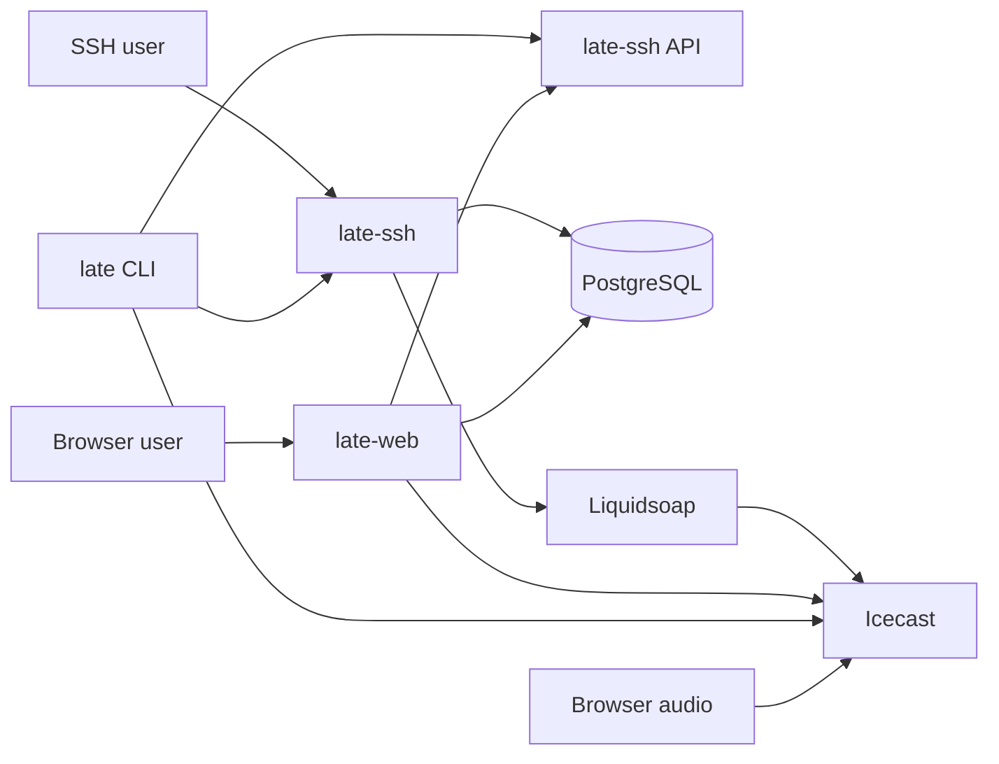

# 01. System Overview

## What this project is

`late.sh` is a terminal-first social app delivered primarily over SSH.

It combines:

- chat
- music streaming
- browser/CLI pairing
- terminal games
- multiplayer rooms
- public web profiles
- a shared ASCII artboard

## The four application crates

```text
late-core  -> shared DB/models/telemetry foundation
late-ssh   -> SSH server + TUI + HTTP API + live runtime
late-web   -> public website + browser pairing + stream proxy
late-cli   -> companion CLI with local audio + pairing
```

## Big-picture topology



## Core platform dependencies

- **PostgreSQL** — durable application data
- **russh** — SSH server/client implementation
- **axum** — HTTP server/router
- **ratatui** — terminal UI rendering
- **Tokio** — async runtime and task orchestration
- **Icecast** — live audio streaming
- **Liquidsoap** — playlist/radio source switching

## The main architectural idea

This project is split between two kinds of state:

### Durable state
Stored in Postgres:
- users
- profiles
- chat history
- votes
- game saves
- room metadata
- artboard snapshots
- chips economy
- bonsai state

### Live runtime state
Held in memory inside `late-ssh`:
- active SSH sessions
- token routing for paired clients
- live browser/CLI pairing state
- current app subscriptions
- activity feed
- live room table state
- live artboard server state

That split explains most of the repo structure.

## What `late-ssh` really is

`late-ssh` is not just the SSH frontend. It is the main real-time backend.

It owns:
- the SSH session lifecycle
- the TUI app state machine
- most domain services
- the pairing WebSocket endpoint
- browser chat/tunnel integration
- presence/activity state
- several in-memory registries and managers

## What `late-web` really is

`late-web` is a web shell around the main runtime.

It does two kinds of work:

1. **server-rendered public pages** backed by Postgres
2. **browser entrypoints** that connect back to `late-ssh` for real-time behavior

## What `late-cli` really is

`late-cli` is a companion client, not a separate backend.

It exists so users can:
- keep the TUI in the terminal
- play audio locally
- feed visualizer data back into the TUI
- use OpenSSH/hardware-backed auth flows when needed

## Why contributors should care

When you change something, first figure out whether it belongs to:

- shared domain/persistence (`late-core`)
- live runtime/session behavior (`late-ssh`)
- browser/public rendering (`late-web`)
- local client behavior (`late-cli`)

That choice usually determines almost every file you will touch next.
