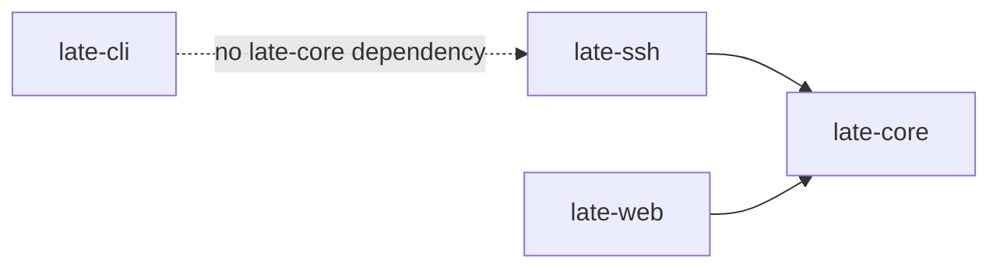

# 02. Crate Breakdown

## `late-core`

### Role
Shared foundation crate for persistence, models, migrations, telemetry, and repo-wide utilities.

### Important files

- `late-core/src/lib.rs`
- `late-core/src/db.rs`
- `late-core/src/model.rs`
- `late-core/src/models/`
- `late-core/src/nonogram.rs`
- `late-core/src/rate_limit.rs`
- `late-core/src/telemetry.rs`
- `late-core/src/test_utils.rs`
- `late-core/src/bin/gen_nonograms.rs`

### Owns

- DB pool creation
- migrations
- shared table-backed models
- shared API/data types
- telemetry initialization
- offline nonogram generation contracts
- shared test DB helpers

### Typical reasons to edit it

- adding a new table or model
- changing persisted schema
- adding shared helper types
- changing telemetry setup
- adding shared business data contracts

---

## `late-ssh`

### Role
Primary live runtime of the product.

### Important files

- `late-ssh/src/main.rs`
- `late-ssh/src/ssh.rs`
- `late-ssh/src/api.rs`
- `late-ssh/src/state.rs`
- `late-ssh/src/session.rs`
- `late-ssh/src/dartboard.rs`
- `late-ssh/src/app/`

### Owns

- SSH server
- TUI session creation
- app render/input/tick loop
- live session registries
- pairing APIs
- chat/vote/profile/game/room services
- active-user presence/activity state
- artboard runtime server
- room game managers

### App subdomains

Under `late-ssh/src/app/` the major areas are:

- `chat/`
- `vote/`
- `profile/`
- `games/`
- `rooms/`
- `artboard/`
- `bonsai/`
- `dashboard/`
- `ai/`
- shared support modules in `common/`

### Common module pattern

Many features follow this split:

- `state.rs` — local UI state
- `input.rs` — key handling
- `ui.rs` — render logic
- `svc.rs` — async service work

That is the default design pattern when adding features.

---

## `late-web`

### Role
Public browser-facing frontend.

### Important files

- `late-web/src/main.rs`
- `late-web/src/lib.rs`
- `late-web/src/config.rs`
- `late-web/src/pages/mod.rs`
- `late-web/src/pages/connect/`
- `late-web/src/pages/chat/`
- `late-web/src/pages/play/`
- `late-web/src/pages/gallery/`
- `late-web/src/pages/profiles/`
- `late-web/src/pages/stream.rs`

### Owns

- landing page
- pairing page
- browser chat page
- browser TUI demo/tunnel page
- public profiles pages
- artboard gallery page
- audio stream proxy
- some HTMX status/dashboard fragments

### Does not own

It does **not** own most live session logic. For real-time behavior it usually calls or connects to `late-ssh`.

---

## `late-cli`

### Role
Companion CLI for local audio playback and pairing.

### Important files

- `late-cli/src/main.rs`
- `late-cli/src/config.rs`
- `late-cli/src/identity.rs`
- `late-cli/src/ssh.rs`
- `late-cli/src/ws.rs`
- `late-cli/src/audio/`

### Owns

- command-line config parsing
- SSH launch modes
- local audio runtime
- resampling/playback/analyzer
- pairing websocket client
- client-state reporting back to `late-ssh`

### Why it exists

The TUI is best delivered over SSH, but audio is often better played locally. The CLI bridges that gap.

---

## Cross-crate dependency picture

## The important asymmetry

- `late-core` is shared by `late-ssh` and `late-web`
- `late-cli` intentionally stands alone and does not depend on `late-core`

That keeps the CLI lighter and more independent from server internals.
