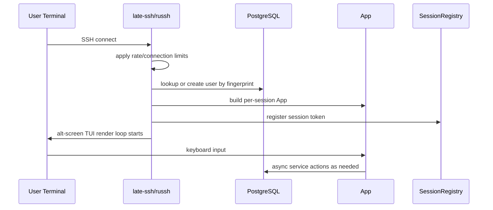
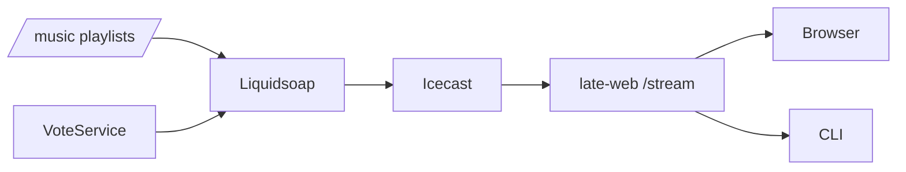

# 03. Runtime Flows

## 1. SSH session flow



### Key points

- identity is based on **SSH public key fingerprint**
- a user may have persistent DB data but a fresh in-memory app each session
- each session gets a **session token** for pairing and browser bridge features

---

## 2. TUI render/update flow

The app is designed to keep rendering synchronous and business logic asynchronous.

### Rough loop

1. services run async and publish updates
2. UI states subscribe to snapshots/events
3. `App::tick()` drains new messages into local state
4. `App::render()` draws from local state only
5. input handlers fire async service work when needed

### Why this matters

This design keeps the SSH UI responsive by avoiding DB/network work during paint.

---

## 3. Pairing flow

```mermaid
flowchart LR
    Client[Browser or late CLI] --> WS[/api/ws/pair]
    WS --> SR[SessionRegistry]
    WS --> PCR[PairedClientRegistry]
    SR --> App[TUI App]
    App --> PCR
```

### SessionRegistry
Used to route messages **into** the SSH session by token.

Examples:
- heartbeat
- visualizer frames
- targeted session events

### PairedClientRegistry
Used to route control messages **out to** the paired client.

Examples:
- mute toggle
- volume up
- volume down

### Result
The TUI can control an external audio client while displaying its state and visualizer data.

---

## 4. Browser flow

### Landing/pairing
- Browser opens `late-web`
- Pairing page uses a session token in the URL
- Page opens a WS connection to `late-ssh /api/ws/pair`
- Browser streams analyzer data and local playback state

### Browser chat
- Browser page is served by `late-web`
- Real-time chat connection goes to `late-ssh`

### Browser TUI demo
- Browser page is served by `late-web`
- Terminal tunnel WS goes to `late-ssh`

### Important pattern
`late-web` often owns page rendering, but `late-ssh` owns real-time behavior.

---

## 5. Audio flow



### Flow steps

1. local playlists are managed by Liquidsoap
2. Liquidsoap emits stream to Icecast
3. `late-web /stream` proxies the stream for stable client consumption
4. browser or CLI plays the audio
5. paired client sends state/visualizer data back to `late-ssh`

### Control path vs playback path

- **control** originates in TUI and is sent through pairing registry/WS
- **playback** occurs in browser or CLI

---

## 6. Room game flow

### Persistent layer
Postgres stores:
- room metadata
- linked room chat
- possibly user balances/results/snapshots

### Live runtime layer
`late-ssh` process holds:
- table manager(s)
- active player state
- current round state
- process-local multiplayer logic

### Consequence
A room can exist persistently in DB while its active live game logic only exists inside the running process.

---

## 7. Artboard flow

### On startup
- `late-ssh` restores last persisted artboard snapshot if available
- shared in-process artboard server is spawned

### During play
- entering Artboard connects a session-local client
- edits apply to live shared state
- provenance is updated

### Persistence
- snapshots are written to DB on schedule/shutdown/rollover
- `late-web /gallery` reads saved snapshots, not live RAM state

---

## 8. Now-playing flow

- `late-ssh` polls Icecast metadata periodically
- publishes latest track through a watch channel
- TUI sidebar reads from that channel
- `late-web` also fetches now-playing info through the SSH API path for page fragments

This is a good example of a small shared read model rather than each UI scraping Icecast directly.
