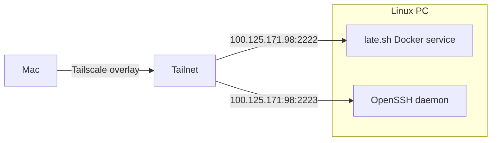

# Tailscale + SSH PC Access Rebuild Guide

> [!summary]
> This note explains how and why direct connectivity failed on the residence network, how Tailscale fixed the issue, how SSH was separated from the `late.sh` service, and how to rebuild the setup later if the machine, ports, or network change.

## Why this note exists

This is **not only a `late.sh` note**.

The final setup is a combination of:

- **general PC networking configuration**
- **general SSH server configuration**
- **Tailscale device-to-device connectivity**
- **application-specific port separation**

So this document should live under a broader **networking / machine configuration** area, not only under `late_server`.

---

# 1. Executive summary

The original goal was to connect from a **Mac** to a **Linux PC** while both were on a student residence network.

Direct LAN access failed even though:

- the Linux host was up
- ports were listening
- the firewall was open
- the application worked locally

The likely cause was **client isolation / peer isolation** on the residence Wi-Fi.

The successful fix was:

1. install and connect **Tailscale** on both machines
2. use the Linux PC's **Tailscale IP** instead of the residence-network IP
3. keep the application port and the machine SSH port **separate**
4. configure SSH to listen on **2223** because `2222` was already used by `late.sh`

Final result:

- `100.125.171.98:2222` → `late.sh`
- `100.125.171.98:2223` → SSH into the Linux PC

---

# 2. Networking mental model

## 2.1 The important layers

When trying to reach another machine, think in layers:

1. **Is the machine connected to any network?**
2. **Does the machine have an IP address?**
3. **Can the source machine route packets to that IP?**
4. **Is the destination network allowing peer-to-peer traffic?**
5. **Is a service listening on the target port?**
6. **Is the firewall allowing that traffic?**
7. **Is the correct protocol running behind that port?**

A lot of confusion comes from mixing these layers together.

> [!note]
> "The port is open" does **not** mean "the network path exists".

---

## 2.2 How to read the common network concepts

### LAN

**LAN** = Local Area Network.

This is the local network you are physically connected to, for example:

- home Wi-Fi
- dorm Wi-Fi
- office Wi-Fi
- Ethernet on the same router/switch

Typical LAN IP ranges are:

- `192.168.x.x`
- `10.x.x.x`
- `172.16.x.x` to `172.31.x.x`

Example:

```text
10.156.0.253
```

That kind of IP usually belongs to the local network you are currently on.

### WAN / internet path

This is the broader path outside your local network. On managed networks, two devices may both have internet access while still being blocked from talking directly to each other locally.

### Tailscale overlay network

Tailscale creates a **private virtual network** on top of the regular network.

Typical Tailscale IPv4 addresses look like:

```text
100.x.y.z
```

Example from this setup:

```text
100.125.171.98
```

This address is often the one that matters most for device-to-device connectivity when the local LAN is hostile or restrictive.

### Port

A **port** is a numbered communication endpoint on a machine.

Examples:

- `22` → default SSH
- `2222` → custom app / custom SSH / anything else
- `3000` → often a web app
- `4001` → another app-specific port

A port does not tell you what the service *should* be; it only tells you where some service is listening.

### Service

A **service** is the program behind the port.

Examples in this case:

- `late.sh` service behind `2222`
- `sshd` service behind `2223` 

### Firewall

A firewall controls whether traffic is allowed to reach a service.

Even if a service is listening, the firewall can still block the connection.

### Routing

Routing answers the question:

> How does my machine know where to send packets for this IP?

When the Mac said:

```text
Network is unreachable
```

that strongly suggested the Mac was **not yet connected to Tailscale**, so it had no route to `100.125.171.98`.

---

# 3. Short SSH introduction

## What SSH is

**SSH** means **Secure Shell**.

It is the standard protocol for securely logging into another machine and executing commands remotely.

Typical usage:

```bash
ssh username@host
```

Or on a custom port:

```bash
ssh username@host -p 2223
```

## SSH pieces that matter

- **SSH client**: the initiating side, here the Mac
- **SSH server / daemon**: `sshd`, running on the Linux PC
- **host keys**: prove the server's identity
- **user account**: the Linux user being logged into
- **port**: the endpoint used by `sshd`

## Why SSH mattered here

The goal was not only to reach the app, but to reach the **machine itself**.

That required a proper SSH server separate from the application's port.

---

# 4. Short Tailscale introduction

## What Tailscale is

Tailscale is a mesh VPN built on top of WireGuard.

It gives enrolled devices a secure private network, even when they are:

- behind NAT
- on different networks
- on managed Wi-Fi
- on client-isolated networks

## Why Tailscale solved the real problem

The residence Wi-Fi likely blocked direct device-to-device traffic.

Tailscale bypassed that by giving both machines a private overlay path.

Instead of relying on the residence LAN IP, the Mac used the Linux PC's Tailscale IP:

```text
100.125.171.98
```

## Why Tailscale was better than changing the app

The app was already working locally.

The real failure was the **network path**, not the app itself.

So Tailscale addressed the actual bottleneck.

---

# 5. Incident timeline and observed issues

## 5.1 Initial state

The Linux machine ran `late.sh` in Docker and exposed application ports.

The expectation was that the Mac could connect directly over the residence Wi-Fi.

## 5.2 What failed

The Mac could not reach the Linux PC through the residence network.

Symptoms:

- app available locally on Linux
- listening ports present
- firewall rules appeared correct
- no usable end-to-end connectivity from Mac to Linux over LAN

## 5.3 Likely root cause

The residence network likely enforced one or more of:

- client isolation
- AP isolation
- guest network restrictions
- VLAN separation
- managed peer-to-peer blocking

## 5.4 First Tailscale issue

On Linux:

```text
Failed to connect to local Tailscale daemon
```

Cause:
- Tailscale installed, but the daemon was not running

Fix:
- start `tailscaled`
- run `tailscale up`

## 5.5 Second Tailscale issue

On the Mac:

```text
Network is unreachable
```

Cause:
- Tailscale on the Mac was not actually running, so there was no route to the Linux Tailscale IP

Fix:
- start Tailscale correctly on macOS
- authenticate the Mac into the same tailnet

## 5.6 Third issue: port conflict

The Linux Tailscale IP worked, but port `2222` was already occupied by the `late.sh` service.

Cause:
- `2222` was app traffic, not SSH traffic

Fix:
- configure SSH to use a different port: `2223`

## 5.7 Fourth issue: SSH host keys missing

Running:

```bash
sudo sshd -t
```

initially produced:

```text
sshd: no hostkeys available -- exiting.
```

Cause:
- the SSH server had no host keys generated

Fix:

```bash
sudo ssh-keygen -A
```

## 5.8 Fifth issue: wrong service unit assumption

Restarting `ssh.service` failed.

Cause:
- the actual service unit on this machine is `sshd.service`

Fix:
- use `sshd`, not `ssh`

---

# 6. Final architecture



## Interpretation

- `2222` belongs to the application
- `2223` belongs to the machine's SSH daemon
- Tailscale is the network path making both reachable privately

---

# 7. Final machine-specific configuration

## 7.1 Linux PC

### Identity

- user: `gandalf`
- Tailscale IP: `100.125.171.98`

### Application port layout

- `late.sh` → `2222`
- SSH → `2223`

### SSH config tracked in dotfiles

Dotfile path:

```text
~/Documents/Storm/Arcane/sshd/etc/ssh/sshd_config.d/50-tailscale-port.conf
```

Contents:

```conf
# Dedicated SSH port for Tailscale device-to-device access.
# Stow target: /
Port 2223
```

### Dotfile deployment

```bash
cd ~/Documents/Storm/Arcane
sudo stow -t / sshd
```

### SSH host keys

```bash
sudo ssh-keygen -A
```

### SSH service

```bash
sudo systemctl enable --now sshd
```

### SSH config validation

```bash
sudo sshd -t
```

### Listening check

```bash
ss -ltnp | grep 2223
```

Expected shape:

```text
LISTEN ... 0.0.0.0:2223
LISTEN ... [::]:2223
```

### Firewall rule

```bash
sudo ufw allow from 100.64.0.0/10 to any port 2223 proto tcp
```

This restricts SSH access to the Tailscale address space.

---

## 7.2 Mac

### Requirements

- Tailscale installed
- Tailscale running
- signed into the same tailnet

### Connectivity test

```bash
tailscale ping 100.125.171.98
```

### Final SSH command

```bash
ssh gandalf@100.125.171.98 -p 2223
```

---

# 8. How to diagnose this kind of problem in the future

Use this decision tree whenever one machine cannot reach another.

## Step 1: Is the target machine on the network?

On the target machine:

```bash
ip addr
```

or for Tailscale:

```bash
tailscale ip -4
```

## Step 2: Is the client on the same usable network path?

If using Tailscale, verify the client is really connected:

```bash
tailscale status
```

## Step 3: Is the route valid?

If you see `Network is unreachable`, suspect:

- Tailscale is not running
- the client has no route to the target IP
- the wrong IP is being used

## Step 4: Is the port actually listening?

On Linux:

```bash
ss -ltnp | grep 2223
```

## Step 5: Is the firewall allowing it?

```bash
sudo ufw status
```

## Step 6: Is the expected service behind the port?

Ask:

- is this port SSH?
- is this port Docker/app traffic?
- am I connecting to the machine or to the application?

This exact distinction prevented confusion here.

---

# 9. Rebuild guide

This section is meant to survive future machine changes.

## Scenario A: same concept, different Linux machine

If the machine changes but the model stays the same:

1. install Tailscale
2. join the same tailnet
3. install OpenSSH server
4. choose an SSH port not used by apps
5. deploy SSH config from dotfiles
6. allow the port in UFW from the Tailscale range
7. validate with `sshd -t`
8. test with `tailscale ping`
9. SSH in from the Mac

## Scenario B: the app port changes

Only the application mapping changes.

Example:

- old: `late.sh` on `2222`
- new: `late.sh` on `4000`

Then SSH can remain on `2223` unchanged.

## Scenario C: SSH port changes

If `2223` later conflicts with something else:

1. edit the SSH drop-in in dotfiles
2. change the port
3. stow it again
4. update the firewall rule
5. restart `sshd`
6. update the SSH command on the Mac

## Scenario D: Tailscale IP changes

Do **not** rely on memory.

Always re-check on the Linux PC:

```bash
tailscale ip -4
```

Then reconnect using the new IP.

## Scenario E: new client machine

Any new client only needs:

- Tailscale installed and authenticated
- network path to the tailnet
- SSH command using the Linux Tailscale IP and SSH port

---

# 10. Rebuild checklist

> [!check]
> Use this if rebuilding from scratch.

## Linux PC checklist

- [ ] Install Tailscale
- [ ] Start and authenticate Tailscale
- [ ] Confirm `tailscale ip -4`
- [ ] Install OpenSSH server
- [ ] Generate host keys with `sudo ssh-keygen -A`
- [ ] Ensure dotfile package exists for SSH config
- [ ] Deploy with `sudo stow -t / sshd`
- [ ] Enable and start `sshd`
- [ ] Validate with `sudo sshd -t`
- [ ] Confirm listening port with `ss -ltnp | grep <port>`
- [ ] Add UFW rule for the SSH port from `100.64.0.0/10`

## Mac checklist

- [ ] Install Tailscale
- [ ] Log into the same tailnet
- [ ] Confirm Tailscale is running
- [ ] `tailscale ping <linux-tailscale-ip>`
- [ ] `ssh <user>@<linux-tailscale-ip> -p <ssh-port>`

---

# 11. Canonical commands for this setup

## Linux PC

```bash
cd ~/Documents/Storm/Arcane
sudo stow -t / sshd
sudo ssh-keygen -A
sudo systemctl enable --now sshd
sudo sshd -t
ss -ltnp | grep 2223
sudo ufw allow from 100.64.0.0/10 to any port 2223 proto tcp
tailscale ip -4
```

## Mac

```bash
tailscale ping 100.125.171.98
ssh gandalf@100.125.171.98 -p 2223
```

---

# 12. Lessons learned

1. **Connectivity failures are often network-path failures, not application failures.**
2. **Managed Wi-Fi can allow internet access while blocking peer-to-peer device access.**
3. **Tailscale is an infrastructure fix, not an application fix.**
4. **Application ports and machine-access ports should be kept separate.**
5. **Dotfile-managed system configuration is easier to rebuild and audit.**
6. **Service names differ across distros and packaging choices.**
7. **SSH host keys are required before `sshd` can operate normally.**

---

# 13. Final reference

> [!success]
> Final working setup:
> - Linux Tailscale IP: `100.125.171.98`
> - `late.sh` on port `2222`
> - SSH on port `2223`
> - Linux username: `gandalf`
> - SSH config tracked in `~/Documents/Storm/Arcane/sshd/...`

Final command:

```bash
ssh gandalf@100.125.171.98 -p 2223
```
