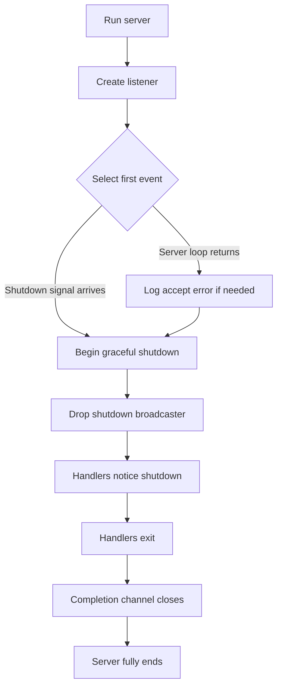
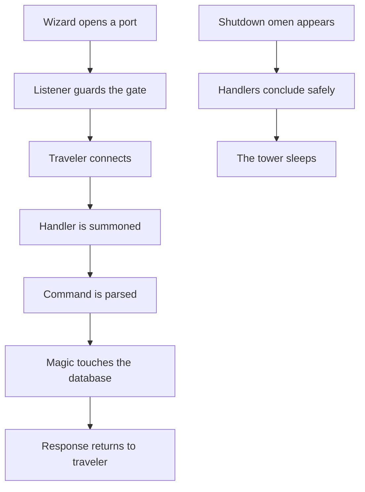

# The Spell book of the Listening Golem

> [!info] Quest
> A young wizard has discovered a strange Rust construct: an async server that listens, accepts wanderers, and shuts down with grace.
> 
> This scroll explains the runes without assuming mastery of Rust.

---

## The First Revelation: This is **not** a class

In Rust, this:

```rust
struct Listener { ... }
```

is a **struct**, not a class.

And this:

```rust
impl Listener {
    async fn run(&mut self) -> crate::Result<()> { ... }
}
```

is an **implementation block**, where methods are bound to the struct.

### Wizard translation
- **class fields** → struct fields
- **class methods** → methods in `impl`
- **object instance** → struct value

---

## The Great Shape of the Spell

This file is an **async TCP server spell**.

It performs three acts:

1. **Listens** for incoming travelers on a TCP port
2. **Summons a handler** for each connection
3. **Dismisses all servants gracefully** when shutdown is invoked

---

## The Main Beings in this Tale

### `Listener`
The **tower keeper**. It owns the server-wide state.

It holds:
- the database relic
- the TCP listener
- a semaphore to limit connections
- a broadcast channel to announce shutdown
- a channel used to know when all handlers are gone

### `Handler`
The **servant bound to one traveler**.

It holds:
- a database handle
- one network connection
- a shutdown receiver
- a sender kept alive so the server knows this task still exists

---

## Map of the Realm



---

## The Key Runes You Should Learn First

Before diving too deep, learn these Rust runes:

### 1. `struct`
Defines data.

```rust
struct Handler {
    db: Db,
    connection: Connection,
}
```

### 2. `impl`
Defines methods for a struct.

```rust
impl Handler {
    async fn run(&mut self) -> crate::Result<()> {
        Ok(())
    }
}
```

### 3. `Result<T, E>`
A value that is either success or failure.

- `Ok(value)` → success
- `Err(error)` → failure

### 4. `Option<T>`
A value that may or may not exist.

- `Some(value)` → exists
- `None` → absent

### 5. `?`
Early-return on error.

```rust
let socket = self.accept().await?;
```

Meaning:
> If `accept()` fails, stop and return the error.

### 6. `async` and `.await`
Marks code that pauses without blocking the whole program.

### 7. `Arc<T>`
Shared ownership for data used by multiple tasks.

### 8. `tokio::select!`
Wait for multiple async events and react to the first one that completes.

---

## Anatomy of the `Listener`

```rust
struct Listener {
    db_holder: DbDropGuard,
    listener: TcpListener,
    limit_connections: Arc<Semaphore>,
    notify_shutdown: broadcast::Sender<()>,
    shutdown_complete_tx: mpsc::Sender<()>,
}
```

### What each field means

| Field | Meaning |
|---|---|
| `db_holder` | Holds the shared database |
| `listener` | The socket accepting inbound TCP connections |
| `limit_connections` | Prevents too many simultaneous clients |
| `notify_shutdown` | Sends the shutdown omen to all handlers |
| `shutdown_complete_tx` | Used to know when every handler has vanished |

---

## Anatomy of the `Handler`

```rust
struct Handler {
    db: Db,
    connection: Connection,
    shutdown: Shutdown,
    _shutdown_complete: mpsc::Sender<()>,
}
```

### Curious rune: `_shutdown_complete`
This field is intentionally **not used directly**.

Its purpose is subtle:
- each handler owns a clone of the sender
- when the handler is dropped, its sender is dropped too
- when **all** senders are gone, the receiver knows every handler has finished

This is very Rust-like: sometimes a field exists for its **drop behavior**, not for explicit method calls.

---

## The Ritual of `run(listener, shutdown)`

```rust
pub async fn run(listener: TcpListener, shutdown: impl Future)
```

### Meaning
- takes a TCP listener
- takes **any future** that represents a shutdown signal
- runs until either:
  - the server stops with an error, or
  - the shutdown future completes

### Why `impl Future`?
It means:
> “Give me anything async that eventually completes.”

For example:
- Ctrl+C signal
- a timeout
- a cancellation trigger
---
> [!warning] Wizard Summary
> So there as layers of understanding to this magic but it can be interpreted in the next manner:
> _Servants_
> + **Listener**: Are the servants in charge of handling the Transmission Control Protocol (TCP)
> + **Handler**: Is the servant who will be assigned to a client who requested a connection, the handler will have access to the vault of information
> _Actions_:
> + **Request Connection**: Wanderer might want to get into the tower, but no person should obtain that power, servants will attend them instead
> + **Broadcast**: The Tower will have a leader to communicate the tower state, this will project his voice throughout all servants which are listening from the `broadcast` spell. 


---

## The Twin Channels

```rust
let (notify_shutdown, _) = broadcast::channel(1);
let (shutdown_complete_tx, mut shutdown_complete_rx) = mpsc::channel(1);
```

### `broadcast`
One sender, many receivers.

Used for:
- announcing shutdown to all active handlers

### `mpsc`
Many senders, one receiver.

Used for:
- detecting when all handlers are done

---

## The Forked Fate: `tokio::select!`

```rust
tokio::select! {
    res = server.run() => { ... }
    _ = shutdown => { ... }
}
```

This means both futures are watched at once.

Whichever completes first wins.

### If `server.run()` completes first
Something likely went wrong while accepting connections.

### If `shutdown` completes first
The graceful shutdown sequence begins.

---

## Graceful Shutdown, or: How Not to Explode the Tower

After the `select!`, the code does this:

```rust
drop(notify_shutdown);
drop(shutdown_complete_tx);
let _ = shutdown_complete_rx.recv().await;
```

### Why?

#### `drop(notify_shutdown)`
Causes handlers listening on shutdown-related state to stop waiting forever and begin winding down.

#### `drop(shutdown_complete_tx)`
Drops the server's final sender clone.
Now only handler-owned sender clones remain.

#### `shutdown_complete_rx.recv().await`
Waits until those handler clones are also dropped.
When all handlers are gone, the channel closes.

### Wizard summary
The server says:
> “All servants, conclude your current workings and depart. I shall wait until the last lantern goes dark.”

---

## Inside `Listener::run()`

This loop is the heart of the accepting spell.

### Step 1: acquire a permit

```rust
let permit = self
    .limit_connections
    .clone()
    .acquire_owned()
    .await
    .unwrap();
```

This is a gatekeeper.

If too many connections already exist, the server waits.

When the permit is dropped, another traveler may enter.

### Why `Arc<Semaphore>`?
Because multiple async tasks must share the same connection limit.

---

### Step 2: accept a socket

```rust
let socket = self.accept().await?;
```

This tries to accept a new client.

The `?` says:
> If it fails in a fatal way, return the error immediately.

---

### Step 3: create a handler

```rust
let mut handler = Handler {
    db: self.db_holder.db(),
    connection: Connection::new(socket),
    shutdown: Shutdown::new(self.notify_shutdown.subscribe()),
    _shutdown_complete: self.shutdown_complete_tx.clone(),
};
```

Each connection gets:
- access to the shared database
- a protocol-aware connection wrapper
- its own shutdown receiver
- its own completion-tracking sender clone

---

### Step 4: spawn a task

```rust
tokio::spawn(async move {
    if let Err(err) = handler.run().await {
        error!(cause = ?err, "connection error");
    }
    drop(permit);
});
```

This creates a new concurrent task.

### Why `move`?
Because the task must **own** `handler` and `permit`.
It may outlive the current loop iteration.

### Why drop the permit inside the task?
Because the connection slot should only be returned when that client is truly done.

---

## The Backoff Spell in `accept()`

If accept fails, the code retries with increasing delay:

- 1 second
- 2 seconds
- 4 seconds
- 8 seconds
- ...
- until 64 seconds

This is called **exponential backoff**.


This protects the server from immediately hammering the system when resources are strained.

---

## Inside `Handler::run()`

This is the per-connection processing loop.

```rust
while !self.shutdown.is_shutdown() {
```

As long as shutdown has not already been declared, keep serving the client.

### Then another `select!`

```rust
let maybe_frame = tokio::select! {
    res = self.connection.read_frame() => res?,
    _ = self.shutdown.recv() => {
        return Ok(());
    }
};
```

The handler waits for **either**:
- a command from the client, or
- a shutdown signal

If shutdown arrives first, it exits cleanly.

---

## Interpreting `maybe_frame`

```rust
let frame = match maybe_frame {
    Some(frame) => frame,
    None => return Ok(()),
};
```

### Meaning
- `Some(frame)` → the client sent a request
- `None` → the client disconnected

No more frames means the traveler has left the tower.

---

## From Raw Frame to Command Spell

```rust
let cmd = Command::from_frame(frame)?;
```

This parses the raw Redis protocol frame into a command object.

If invalid, the `?` returns the error.

Then:

```rust
debug!(?cmd);
```

This logs the command.

Then:

```rust
cmd.apply(&self.db, &mut self.connection, &mut self.shutdown).await?;
```

This performs the actual magic:
- reads/writes data
- mutates database state
- writes responses back to the client

---

## What Makes This File Feel Advanced?

Because it mixes many Rust ideas at once:

- structs and impls
- async/await
- shared ownership with `Arc`
- semaphores
- channels
- ownership movement into tasks
- explicit drop behavior
- error propagation with `?`
- pattern matching with `match`

If you are new, that is normal. This is **not beginner-level Rust syntax**.

---

## Recommended Learning Order for the Apprentice

### Study first
1. `struct` and `impl`
2. ownership and borrowing
3. `Option` and `Result`
4. `?` operator
5. `async fn` and `.await`
6. `Arc<T>`
7. Tokio basics: `spawn`, channels, `select!`

### Then return to this file
When you re-read it, much of the fog will lift.

---

## Tiny Lexicon of Runes

| Rune | Meaning |
|---|---|
| `&self` | borrow self immutably |
| `&mut self` | borrow self mutably |
| `.await` | pause until async work completes |
| `?` | return early on error |
| `Some(x)` | option contains a value |
| `None` | option contains no value |
| `Ok(x)` | result succeeded |
| `Err(e)` | result failed |
| `Arc<T>` | shared ownership across tasks |
| `tokio::spawn` | run async task concurrently |
| `tokio::select!` | wait for whichever async event finishes first |

---

## Final Counsel from the Golem

> [!tip] Should you read Rust docs first?
> Yes — but only enough to understand the runes listed above.
> 
> Do **not** try to master all of Rust before revisiting this file.
> Learn the fundamentals, then return to this server scroll with fresh eyes.

---

## Next Spells to Study

If you wish, the next best scrolls to study are:

- Rust Book: ownership, structs, enums, error handling, async
- Tokio tutorial: tasks, channels, `select!`

---

## Closing Image



> [!success] In one sentence
> This file defines a small async Redis server where a `Listener` accepts connections, spawns a `Handler` for each client, and shuts everything down gracefully when the final signal arrives.
