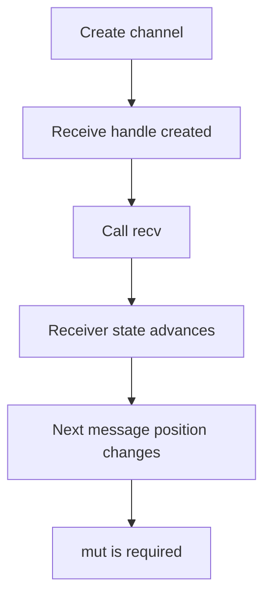

# The Spellbook of `mut` in Rust

> [!info] Quest
> A wizard has encountered a curious rune before a receiver:
>
> ```rust
> let (shutdown_complete_tx, mut shutdown_complete_rx) = mpsc::channel(1);
> ```
>
> Why is `mut` needed there? And is this a common practice in Rust?

---

## The Short Answer

Yes, this is common Rust practice.

The receiver is marked `mut` because calling:

```rust
shutdown_complete_rx.recv().await
```

requires a **mutable receiver**.

That is because `recv()` changes the receiver's internal state.

---

## The Rune Itself

```rust
let (shutdown_complete_tx, mut shutdown_complete_rx) = mpsc::channel(1);
```

Read it like this:

- `shutdown_complete_tx` = sender half of the channel
- `shutdown_complete_rx` = receiver half of the channel
- `mut` = this binding may be used in a way that mutates the value

The important part is not that the *data being received* is mutable.
The important part is that the **receiver object itself** changes as it receives messages.

---

## Why Does `recv()` Need `mut`?

The receiver method is effectively shaped like this:

```rust
recv(&mut self)
```

That means:

> “To receive a message, I need mutable access to the receiver itself.”

So this works:

```rust
let (tx, mut rx) = mpsc::channel(1);
let _ = rx.recv().await;
```

But this would fail:

```rust
let (tx, rx) = mpsc::channel(1);
let _ = rx.recv().await;
```

because `rx` was not declared mutable.

---

## Why Would Receiving Mutate the Receiver?

Because the receiver keeps internal state.

Every time it receives, it may need to update:

- which message is next
- whether the queue is now empty
- whether the channel is closed
- async wakeup / polling state
- bookkeeping about what has already been consumed

So after one `recv()`, the receiver is no longer in the exact same state as before.

That is why Rust requires `&mut self`.

---

## The Core Rust Rule

If a method takes:

```rust
&mut self
```

then the variable you call it on must be declared with `mut`.

### Example

```rust
let mut book = Spellbook::new();
book.turn_page();
```

If `turn_page()` changes the spellbook, the variable must be mutable.

The same principle applies to channel receivers.

---

## Why the Sender Often Does **Not** Need `mut`

In many channel APIs, the sender's methods take `&self` instead of `&mut self`.

That means the binding itself does not need to be mutable.

So this is common:

```rust
let (tx, mut rx) = mpsc::channel(1);
```

Not:

```rust
let (mut tx, mut rx) = mpsc::channel(1);
```

unless the sender is also used by methods requiring mutable access.

---

## A Wizard Analogy

Imagine the receiver as a steward with a stack of letters.

Each time the steward takes one letter:

- the stack becomes smaller
- the next unread position changes
- the steward's state is updated

So receiving is not passive.
It changes the steward.

Thus the rune of mutability is required.

---

## In the Async Server Scroll

The line:

```rust
let (shutdown_complete_tx, mut shutdown_complete_rx) = mpsc::channel(1);
```

exists because later the code does:

```rust
let _ = shutdown_complete_rx.recv().await;
```

And `recv()` needs `&mut self`.

So the `mut` is not decorative.
It is required by the method signature.

---

## Is This Common Practice?

Yes — very common.

You will often see patterns like:

```rust
let mut rx = something();
rx.next().await;
```

or:

```rust
let (tx, mut rx) = mpsc::channel(8);
while let Some(msg) = rx.recv().await {
    // process message
}
```

This is normal in Rust whenever:

- an iterator advances
- a stream advances
- a channel receiver consumes messages
- a parser moves through input
- an object maintains internal progress state

---

## Common Places You See `mut` for State Advancement

### 1. Channel receivers

```rust
let (tx, mut rx) = mpsc::channel(8);
let _ = rx.recv().await;
```

### 2. Iterators

```rust
let mut iter = vec![1, 2, 3].into_iter();
iter.next();
```

Why `mut`?
Because `next()` advances the iterator.

### 3. Streams

```rust
let mut stream = some_stream();
stream.next().await;
```

### 4. Parsers / readers

Anything that moves a cursor forward may need mutable access.

---

## What `mut` Means Here — and What It Does **Not** Mean

### It means:
- the binding may be used through methods that mutate the value
- the receiver's internal state changes over time

### It does **not** necessarily mean:
- the underlying messages are mutable
- the data inside the channel is being edited in place
- the variable must be reassigned manually

So `mut rx` does **not** mean “I will rewrite `rx` myself.”
It often means “I will call methods on `rx` that require mutable access.”

---

## Tiny Comparison

### Immutable binding

```rust
let x = 5;
```

You cannot use `x` in ways that require mutable access.

### Mutable binding

```rust
let mut x = 5;
x += 1;
```

Or, with methods:

```rust
let mut iter = vec![1, 2, 3].into_iter();
iter.next();
```

The mutation may be direct or hidden behind a method.

---

## Mermaid: The Receiver Changes State



---

## A Useful Mental Model

When you see:

```rust
let mut rx = ...;
```

ask:

> “Will I call methods on this value that consume progress, advance a cursor, or change internal state?”

If yes, `mut` is often expected.

---

## Final Counsel from the Golem

> [!tip] Rule of thumb
> If a method takes `&mut self`, the variable you call it on must be declared `mut`.
>
> Channel receivers commonly need this because receiving advances the receiver's state.

---

## One-Sentence Summary

`mut shutdown_complete_rx` is a common and normal Rust pattern because `recv()` mutates the receiver's internal state as it consumes messages.
